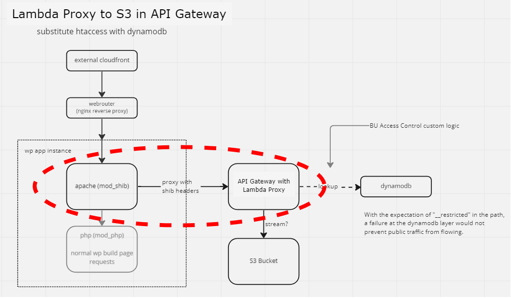

# Wordpress to cloud S3 proxy modelling

### Overview:

This is a demo project to prototype an approach for the proxying of s3 content acquisition for http requests, as part of the BU Wordpress to AWS Cloud project

This is done through [API Gateway](https://docs.aws.amazon.com/apigateway/latest/developerguide/welcome.html) and [Lambda](https://docs.aws.amazon.com/lambda/latest/dg/welcome.html), using the [Serverless Application Model](https://docs.aws.amazon.com/serverless-application-model/latest/developerguide/what-is-sam.html) *(SAM)*
The AWS reference that is most closely followed is: [Set up Lambda proxy integrations in API Gateway](https://docs.aws.amazon.com/apigateway/latest/developerguide/set-up-lambda-proxy-integrations.html)

> *"In Lambda proxy integration, when a client submits an API request, API Gateway passes to the integrated Lambda function the raw request as-is, except that the order of the request parameters is not preserved. This [request data](https://docs.aws.amazon.com/apigateway/latest/developerguide/set-up-lambda-proxy-integrations.html#api-gateway-simple-proxy-for-lambda-input-format) includes the request headers, query string parameters, URL path variables, payload, and API configuration data. The configuration data can include current deployment stage name, stage variables, user identity, or authorization context (if any). The backend Lambda function parses the incoming request data to determine the response that it returns."*

And: [Return binary media from a Lambda proxy integration](https://docs.aws.amazon.com/apigateway/latest/developerguide/lambda-proxy-binary-media.html)

### Context:

This approach applies to the overall project as diagrammed below in the section highlighted in red.
Your browser stands in for apache.



### Prerequisites:

- [Install the SAM CLI](https://docs.aws.amazon.com/serverless-application-model/latest/developerguide/install-sam-cli.html)
- AWS IAM role with admin privileges
- [Visual studio code](https://code.visualstudio.com/download)

### Usage:

You can run the SAM commands *(validate, package, deploy, delete)* by themselves, or make use of some shortcut script (run.sh) that:

- Includes command parameters dealing with default names and parameters not available for sam toml config files.
- Auto-populates the assets bucket with content upon creation and empties it so it can be deleted along with other resources made during stack creation.

```
# Package the app and send it up to a resolved s3 bucket
source run.sh package dev

# Package and deploy the app
source run.sh deploy dev

# Delete the app along with ALL created resources (except the code bucket)
source run.sh delete dev
```

### Demo webpage:

When you run `sam deploy`, one of the stack outputs you will see is called "Webpage". 
This provides a URL you can navigate to with your browser to see S3-originated content displayed.
